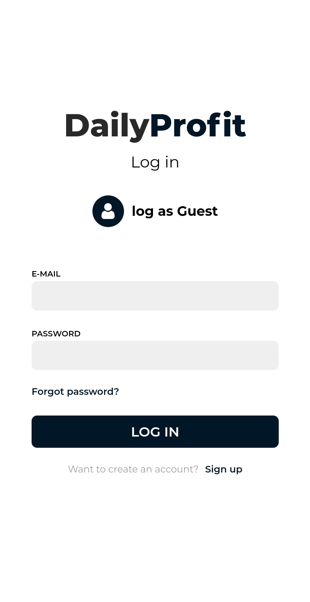
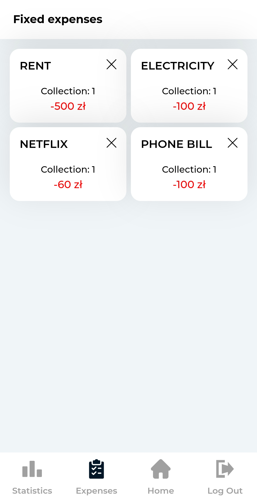

# Daily Profit - home budget analyzer.

Daily Profit is an application that collects your latest bills by analyzing them and visualizing the data
LIVE: www.dailyprofit.jakublukaszewski.pl

## Live Preview

LIVE: www.dailyprofit.jakublukaszewski.pl

## Screenshots






## Instalation

```
git clone https://github.com/JakubLukasz/DailyProfit
cd DailyProfit
npm install
// Add your .env file with firebase settings
npm start     // for developing server
npm run build     // for build file
```

## Technologies

Project is created with:

- React: 17.0.2
- Firebase: 8.8.1
- Chart.js: 3.5.0
- Dayjs: 1.10.7
- Material UI: 5.0.4
- React-router-dom: 5.2.0
- React-hook-form: 7.15.4
- Styled-components: 5.3.0
